# Network Latency & Stability Engine

A lightweight, multithreaded network monitoring service in Java designed to continuously probe target hosts, calculate latency and packet loss rates, and stream high-throughput telemetry without thread contention or I/O bottlenecks.

## Core Features

- **Socket-Level Latency Probing**: Uses low-level `java.net.Socket` to measure true round-trip TCP connection latency in milliseconds across configured host endpoints.
- **Packet Loss Analysis**: Multi-probe sampling algorithm to compute real-time packet loss percentage (`(failed_probes / total_attempts) * 100.0`).
- **Concurrent Non-Blocking Buffer**: In-memory telemetry buffer built on `ConcurrentLinkedQueue` allowing concurrent worker thread writes without thread lock contention.
- **Asynchronous Disk Logging**: Decoupled CSV persistence logger that streams telemetry data to disk while preventing disk I/O latency from stalling probe worker threads.
- **Automated Telemetry Aggregator**: Built-in reporting engine that analyzes logged telemetry, computing per-server average latency, loss percentage, total checks, and identifying high-degradation hosts.

## Architecture



## Getting Started

### Prerequisites
- JDK 11 or higher

### Build & Execution

1. Compile the source:
```bash
javac src/NetworkMonitor.java
```

2. Run the engine:
```bash
java -cp src engine.NetworkMonitor
```

## Telemetry CSV Schema

Logs are saved to `network_telemetry.csv` with the following format:
```csv
timestamp,server,latency_ms,packet_loss_pct,reachable
1785133266442,1.1.1.1,32,0.00,true
1785133266469,google.com,54,0.00,true
```
